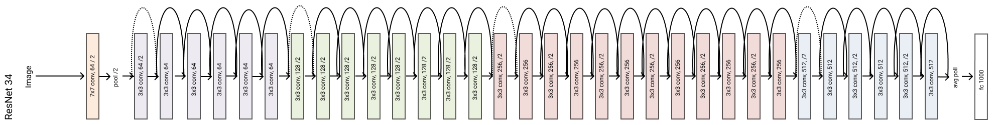
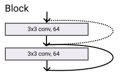
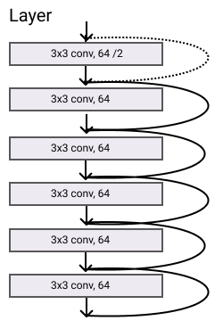
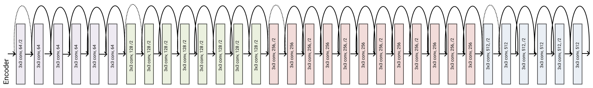

```python
import torch
import torch.nn as nn

from functools import partial
from dataclasses import dataclass
from collections import OrderedDict
```

# Implementing ResNet in PyTorch
Today we are going to implement the famous ResNet from Kaiming He et al. (Microsoft Research). It won the 1st place on the ILSVRC 2015 classification task.

The original paper can be read from [here ](https://arxiv.org/abs/1512.03385) and it is very easy to follow, additional material can be found in this [quora answer](https://www.quora.com/)


*Deeper neural networks are more difficult to train.* Why? One big problem of deeper network is the vanishing gradient. Basically, the model is not able to learn anymore.

To solve this problem, the Authors proposed to use a reference to the previous layer to compute the output at a given layer. In ResNet, the output form the previous layer, called **residual**, is added to the output of the current layer. The following picture visualizes this operation


We are going to make our implementation **as scalable as possible** using one think think unknown to mostly of the data scientiest: **object orienting programming**

## Basic Block

Okay, the first thing is to think about what we need. Well, first of all we need a convolution layer and since PyTorch does not have the 'auto' padding in Conv2d, so we have to code ourself!


```python
class Conv2dAuto(nn.Conv2d):
    def __init__(self, *args, **kwargs):
        super().__init__(*args, **kwargs)
        self.padding =  (self.kernel_size[0] // 2, self.kernel_size[1] // 2) # dynamic add padding based on the kernel_size
        
conv3x3 = partial(Conv2dAuto, kernel_size=3, bias=False)      
        
```


```python
conv = conv3x3(in_channels=32, out_channels=64)
print(conv)
del conv
```

    Conv2dAuto(32, 64, kernel_size=(3, 3), stride=(1, 1), padding=(1, 1), bias=False)
    

## Residual Block
To make clean code is mandatory to think about the main building block of each application, or of the network in our case. The residual block takes an input with `in_channels`, applies some blocks of convolutional layers to reduce it to `out_channels` and sum it up to the original input. If their sizes mismatch, then the input goes into an `identity`. We can abstract this process and create a interface that can be extedend.


```python
class ResidualBlock(nn.Module):
    def __init__(self, in_channels, out_channels):
        super().__init__()
        self.in_channels, self.out_channels =  in_channels, out_channels
        self.blocks = nn.Identity()
        self.shortcut = nn.Identity()   
    
    def forward(self, x):
        residual = x
        if self.should_apply_shortcut: residual = self.shortcut(x)
        x = self.blocks(x)
        x += residual
        return x
    
    @property
    def should_apply_shortcut(self):
        return self.in_channels != self.out_channels
```


```python
ResidualBlock(32, 64)
```


    ResidualBlock(
      (blocks): Identity()
      (shortcut): Identity()
    )


Let's test it with a dummy vector with one one, we should get a vector with two


```python
dummy = torch.ones((1, 1, 1, 1))

block = ResidualBlock(1, 64)
block(dummy)
```


    tensor([[[[2.]]]])


In ResNet each block has a expansion parameter in order to increase the `out_channels`. Also, the identity is defined as a Convolution followed by an Activation layer, this is referred as `shortcut`. Then, we can just extend `ResidualBlock` and defined the `shortcut` function.


```python
from collections import OrderedDict

class ResNetResidualBlock(ResidualBlock):
    def __init__(self, in_channels, out_channels, expansion=1, downsampling=1, conv=conv3x3, *args, **kwargs):
        super().__init__(in_channels, out_channels)
        self.expansion, self.downsampling, self.conv = expansion, downsampling, conv
        self.shortcut = nn.Sequential(OrderedDict(
        {
            'conv' : nn.Conv2d(self.in_channels, self.expanded_channels, kernel_size=1,
                      stride=self.downsampling, bias=False),
            'bn' : nn.BatchNorm2d(self.expanded_channels)
            
        })) if self.should_apply_shortcut else None
        
        
    @property
    def expanded_channels(self):
        return self.out_channels * self.expansion
    
    @property
    def should_apply_shortcut(self):
        return self.in_channels != self.expanded_channels
```


```python
ResNetResidualBlock(32, 64)
```


    ResNetResidualBlock(
      (blocks): Identity()
      (shortcut): Sequential(
        (conv): Conv2d(32, 64, kernel_size=(1, 1), stride=(1, 1), bias=False)
        (bn): BatchNorm2d(64, eps=1e-05, momentum=0.1, affine=True, track_running_stats=True)
      )
    )


### Basic Block
A basic ResNet block is composed by two layers of `3x3` convs/batchnorm/relu. In the picture, the lines represnet the residual operation. The dotted line means that the shortcut was applied to match the input and the output dimension.


Let's first create an handy function to stack one conv and batchnorm layer. Using `OrderedDict` to properly name each sublayer.


```python
from collections import OrderedDict
def conv_bn(in_channels, out_channels, conv, *args, **kwargs):
    return nn.Sequential(OrderedDict({'conv': conv(in_channels, out_channels, *args, **kwargs), 
                          'bn': nn.BatchNorm2d(out_channels) }))
```


```python
conv_bn(3, 3, nn.Conv2d, kernel_size=3)
```


    Sequential(
      (conv): Conv2d(3, 3, kernel_size=(3, 3), stride=(1, 1))
      (bn): BatchNorm2d(3, eps=1e-05, momentum=0.1, affine=True, track_running_stats=True)
    )


```python
class ResNetBasicBlock(ResNetResidualBlock):
    expansion = 1
    def __init__(self, in_channels, out_channels, activation=nn.ReLU, *args, **kwargs):
        super().__init__(in_channels, out_channels, *args, **kwargs)
        self.blocks = nn.Sequential(
            conv_bn(self.in_channels, self.out_channels, conv=self.conv, bias=False, stride=self.downsampling),
            activation(),
            conv_bn(self.out_channels, self.expanded_channels, conv=self.conv, bias=False),
        )
    
```


```python
dummy = torch.ones((1, 32, 224, 224))

block = ResNetBasicBlock(32, 64)
block(dummy).shape
print(block)
```

    ResNetBasicBlock(
      (blocks): Sequential(
        (0): Sequential(
          (conv): Conv2dAuto(32, 64, kernel_size=(3, 3), stride=(1, 1), padding=(1, 1), bias=False)
          (bn): BatchNorm2d(64, eps=1e-05, momentum=0.1, affine=True, track_running_stats=True)
        )
        (1): ReLU()
        (2): Sequential(
          (conv): Conv2dAuto(64, 64, kernel_size=(3, 3), stride=(1, 1), padding=(1, 1), bias=False)
          (bn): BatchNorm2d(64, eps=1e-05, momentum=0.1, affine=True, track_running_stats=True)
        )
      )
      (shortcut): Sequential(
        (conv): Conv2d(32, 64, kernel_size=(1, 1), stride=(1, 1), bias=False)
        (bn): BatchNorm2d(64, eps=1e-05, momentum=0.1, affine=True, track_running_stats=True)
      )
    )
    

### BottleNeck
To increase the network deepths but to decrese the number of parameters, the Authors defined a BottleNeck block that 
"The three layers are 1x1, 3x3, and 1x1 convolutions, where the 1×1 layers are responsible for reducing and then increasing (restoring) dimensions, leaving the 3×3 layer a bottleneck with smaller input/output dimensions." We can extend the `ResNetResidualBlock` and create these blocks.


```python
class ResNetBottleNeckBlock(ResNetResidualBlock):
    expansion = 4
    def __init__(self, in_channels, out_channels, activation=nn.ReLU, *args, **kwargs):
        super().__init__(in_channels, out_channels, expansion=4, *args, **kwargs)
        self.blocks = nn.Sequential(
           conv_bn(self.in_channels, self.out_channels, self.conv, kernel_size=1),
             activation(),
             conv_bn(self.out_channels, self.out_channels, self.conv, kernel_size=3, stride=self.downsampling),
             activation(),
             conv_bn(self.out_channels, self.expanded_channels, self.conv, kernel_size=1),
        )
    
```


```python
dummy = torch.ones((1, 32, 10, 10))

block = ResNetBottleNeckBlock(32, 64)
block(dummy).shape
print(block)
```

    ResNetBottleNeckBlock(
      (blocks): Sequential(
        (0): Sequential(
          (conv): Conv2dAuto(32, 64, kernel_size=(1, 1), stride=(1, 1), bias=False)
          (bn): BatchNorm2d(64, eps=1e-05, momentum=0.1, affine=True, track_running_stats=True)
        )
        (1): ReLU()
        (2): Sequential(
          (conv): Conv2dAuto(64, 64, kernel_size=(3, 3), stride=(1, 1), padding=(1, 1), bias=False)
          (bn): BatchNorm2d(64, eps=1e-05, momentum=0.1, affine=True, track_running_stats=True)
        )
        (3): ReLU()
        (4): Sequential(
          (conv): Conv2dAuto(64, 256, kernel_size=(1, 1), stride=(1, 1), bias=False)
          (bn): BatchNorm2d(256, eps=1e-05, momentum=0.1, affine=True, track_running_stats=True)
        )
      )
      (shortcut): Sequential(
        (conv): Conv2d(32, 256, kernel_size=(1, 1), stride=(1, 1), bias=False)
        (bn): BatchNorm2d(256, eps=1e-05, momentum=0.1, affine=True, track_running_stats=True)
      )
    )
    

### Layer
A ResNet's layer is composed by blocks stacked one after the other. 



We can easily defined it by just stuck `n` blocks one after the other, just remember that the first convolution block has a stide of two since "We perform downsampling directly by convolutional layers that have a stride of 2".


```python
class ResNetLayer(nn.Module):
    def __init__(self, in_channels, out_channels, block=ResNetBasicBlock, n=1, *args, **kwargs):
        super().__init__()
        # 'We perform downsampling directly by convolutional layers that have a stride of 2.'
        downsampling = 2 if in_channels != out_channels else 1
        
        self.blocks = nn.Sequential(
            block(in_channels , out_channels, *args, **kwargs, downsampling=downsampling),
            *[block(out_channels * block.expansion, 
                    out_channels, downsampling=1, *args, **kwargs) for _ in range(n - 1)]
        )

    def forward(self, x):
        x = self.blocks(x)
        return x
```


```python
dummy = torch.ones((1, 32, 48, 48))

layer = ResNetLayer(64, 128, block=ResNetBasicBlock, n=3)
# layer(dummy).shape
layer
```


    ResNetLayer(
      (blocks): Sequential(
        (0): ResNetBasicBlock(
          (blocks): Sequential(
            (0): Sequential(
              (conv): Conv2dAuto(64, 128, kernel_size=(3, 3), stride=(2, 2), padding=(1, 1), bias=False)
              (bn): BatchNorm2d(128, eps=1e-05, momentum=0.1, affine=True, track_running_stats=True)
            )
            (1): ReLU()
            (2): Sequential(
              (conv): Conv2dAuto(128, 128, kernel_size=(3, 3), stride=(1, 1), padding=(1, 1), bias=False)
              (bn): BatchNorm2d(128, eps=1e-05, momentum=0.1, affine=True, track_running_stats=True)
            )
          )
          (shortcut): Sequential(
            (conv): Conv2d(64, 128, kernel_size=(1, 1), stride=(2, 2), bias=False)
            (bn): BatchNorm2d(128, eps=1e-05, momentum=0.1, affine=True, track_running_stats=True)
          )
        )
        (1): ResNetBasicBlock(
          (blocks): Sequential(
            (0): Sequential(
              (conv): Conv2dAuto(128, 128, kernel_size=(3, 3), stride=(1, 1), padding=(1, 1), bias=False)
              (bn): BatchNorm2d(128, eps=1e-05, momentum=0.1, affine=True, track_running_stats=True)
            )
            (1): ReLU()
            (2): Sequential(
              (conv): Conv2dAuto(128, 128, kernel_size=(3, 3), stride=(1, 1), padding=(1, 1), bias=False)
              (bn): BatchNorm2d(128, eps=1e-05, momentum=0.1, affine=True, track_running_stats=True)
            )
          )
          (shortcut): None
        )
        (2): ResNetBasicBlock(
          (blocks): Sequential(
            (0): Sequential(
              (conv): Conv2dAuto(128, 128, kernel_size=(3, 3), stride=(1, 1), padding=(1, 1), bias=False)
              (bn): BatchNorm2d(128, eps=1e-05, momentum=0.1, affine=True, track_running_stats=True)
            )
            (1): ReLU()
            (2): Sequential(
              (conv): Conv2dAuto(128, 128, kernel_size=(3, 3), stride=(1, 1), padding=(1, 1), bias=False)
              (bn): BatchNorm2d(128, eps=1e-05, momentum=0.1, affine=True, track_running_stats=True)
            )
          )
          (shortcut): None
        )
      )
    )


### Encoder
Similarly, the encoder is composed by multiple layer at increasing features size.




```python
class ResNetEncoder(nn.Module):
    """
    ResNet encoder composed by increasing different layers with increasing features.
    """
    def __init__(self, in_channels=3, blocks_sizes=[64, 128, 256, 512], deepths=[2,2,2,2], 
                 activation=nn.ReLU, block=ResNetBasicBlock, *args,**kwargs):
        super().__init__()
        
        self.blocks_sizes = blocks_sizes
        
        self.gate = nn.Sequential(
            nn.Conv2d(in_channels, self.blocks_sizes[0], kernel_size=7, stride=2, padding=3, bias=False),
            nn.BatchNorm2d(self.blocks_sizes[0]),
            activation(),
            nn.MaxPool2d(kernel_size=3, stride=2, padding=1)
        )
        
        self.in_out_block_sizes = list(zip(blocks_sizes, blocks_sizes[1:]))
        self.blocks = nn.ModuleList([ 
            ResNetLayer(blocks_sizes[0], blocks_sizes[0], n=deepths[0], activation=activation, 
                        block=block,  *args, **kwargs),
            *[ResNetLayer(in_channels * block.expansion, 
                          out_channels, n=n, activation=activation, 
                          block=block, *args, **kwargs) 
              for (in_channels, out_channels), n in zip(self.in_out_block_sizes, deepths[1:])]       
        ])
        
        
    def forward(self, x):
        x = self.gate(x)
        for block in self.blocks:
            x = block(x)
        return x
```

## Decoder
The decoder is the last piece we need to create the full network. It is a fully connected layer that maps the features learned by the network to their respective classes. Easily, we can defined it as:


```python
class ResnetDecoder(nn.Module):
    """
    This class represents the tail of ResNet. It performs a global pooling and maps the output to the
    correct class by using a fully connected layer.
    """
    def __init__(self, in_features, n_classes):
        super().__init__()
        self.avg = nn.AdaptiveAvgPool2d((1, 1))
        self.decoder = nn.Linear(in_features, n_classes)

    def forward(self, x):
        x = self.avg(x)
        x = x.view(x.size(0), -1)
        x = self.decoder(x)
        return x

```

## ResNet

Final, we can put all the pieces together and create the final model.


```python
class ResNet(nn.Module):
    
    def __init__(self, in_channels, n_classes, *args, **kwargs):
        super().__init__()
        self.encoder = ResNetEncoder(in_channels, *args, **kwargs)
        self.decoder = ResnetDecoder(self.encoder.blocks[-1].blocks[-1].expanded_channels, n_classes)
        
    def forward(self, x):
        x = self.encoder(x)
        x = self.decoder(x)
        return x
```

We can now defined the five models proposed by the Authors, `resnet18,34,50,101,152`


```python
def resnet18(in_channels, n_classes):
    return ResNet(in_channels, n_classes, block=ResNetBasicBlock, deepths=[2, 2, 2, 2])

def resnet34(in_channels, n_classes):
    return ResNet(in_channels, n_classes, block=ResNetBasicBlock, deepths=[3, 4, 6, 3])

def resnet50(in_channels, n_classes):
    return ResNet(in_channels, n_classes, block=ResNetBottleNeckBlock, deepths=[3, 4, 6, 3])

def resnet101(in_channels, n_classes):
    return ResNet(in_channels, n_classes, block=ResNetBottleNeckBlock, deepths=[3, 4, 23, 3])

def resnet152(in_channels, n_classes):
    return ResNet(in_channels, n_classes, block=ResNetBottleNeckBlock, deepths=[3, 8, 36, 3])
```


```python
from torchsummary import summary

model = resnet101(3, 1000)
summary(model.cuda(), (3, 224, 224))
```

    ----------------------------------------------------------------
            Layer (type)               Output Shape         Param #
    ================================================================
                Conv2d-1         [-1, 64, 112, 112]           9,408
           BatchNorm2d-2         [-1, 64, 112, 112]             128
                  ReLU-3         [-1, 64, 112, 112]               0
             MaxPool2d-4           [-1, 64, 56, 56]               0
                Conv2d-5          [-1, 256, 56, 56]          16,384
           BatchNorm2d-6          [-1, 256, 56, 56]             512
            Conv2dAuto-7           [-1, 64, 56, 56]           4,096
           BatchNorm2d-8           [-1, 64, 56, 56]             128
                  ReLU-9           [-1, 64, 56, 56]               0
           Conv2dAuto-10           [-1, 64, 56, 56]          36,864
          BatchNorm2d-11           [-1, 64, 56, 56]             128
                 ReLU-12           [-1, 64, 56, 56]               0
           Conv2dAuto-13          [-1, 256, 56, 56]          16,384
          BatchNorm2d-14          [-1, 256, 56, 56]             512
    ResNetBottleNeckBlock-15          [-1, 256, 56, 56]               0
           Conv2dAuto-16           [-1, 64, 56, 56]          16,384
          BatchNorm2d-17           [-1, 64, 56, 56]             128
                 ReLU-18           [-1, 64, 56, 56]               0
           Conv2dAuto-19           [-1, 64, 56, 56]          36,864
          BatchNorm2d-20           [-1, 64, 56, 56]             128
                 ReLU-21           [-1, 64, 56, 56]               0
           Conv2dAuto-22          [-1, 256, 56, 56]          16,384
          BatchNorm2d-23          [-1, 256, 56, 56]             512
    ResNetBottleNeckBlock-24          [-1, 256, 56, 56]               0
           Conv2dAuto-25           [-1, 64, 56, 56]          16,384
          BatchNorm2d-26           [-1, 64, 56, 56]             128
                 ReLU-27           [-1, 64, 56, 56]               0
           Conv2dAuto-28           [-1, 64, 56, 56]          36,864
          BatchNorm2d-29           [-1, 64, 56, 56]             128
                 ReLU-30           [-1, 64, 56, 56]               0
           Conv2dAuto-31          [-1, 256, 56, 56]          16,384
          BatchNorm2d-32          [-1, 256, 56, 56]             512
    ResNetBottleNeckBlock-33          [-1, 256, 56, 56]               0
          ResNetLayer-34          [-1, 256, 56, 56]               0
               Conv2d-35          [-1, 512, 28, 28]         131,072
          BatchNorm2d-36          [-1, 512, 28, 28]           1,024
           Conv2dAuto-37          [-1, 128, 56, 56]          32,768
          BatchNorm2d-38          [-1, 128, 56, 56]             256
                 ReLU-39          [-1, 128, 56, 56]               0
           Conv2dAuto-40          [-1, 128, 28, 28]         147,456
          BatchNorm2d-41          [-1, 128, 28, 28]             256
                 ReLU-42          [-1, 128, 28, 28]               0
           Conv2dAuto-43          [-1, 512, 28, 28]          65,536
          BatchNorm2d-44          [-1, 512, 28, 28]           1,024
    ResNetBottleNeckBlock-45          [-1, 512, 28, 28]               0
           Conv2dAuto-46          [-1, 128, 28, 28]          65,536
          BatchNorm2d-47          [-1, 128, 28, 28]             256
                 ReLU-48          [-1, 128, 28, 28]               0
           Conv2dAuto-49          [-1, 128, 28, 28]         147,456
          BatchNorm2d-50          [-1, 128, 28, 28]             256
                 ReLU-51          [-1, 128, 28, 28]               0
           Conv2dAuto-52          [-1, 512, 28, 28]          65,536
          BatchNorm2d-53          [-1, 512, 28, 28]           1,024
    ResNetBottleNeckBlock-54          [-1, 512, 28, 28]               0
           Conv2dAuto-55          [-1, 128, 28, 28]          65,536
          BatchNorm2d-56          [-1, 128, 28, 28]             256
                 ReLU-57          [-1, 128, 28, 28]               0
           Conv2dAuto-58          [-1, 128, 28, 28]         147,456
          BatchNorm2d-59          [-1, 128, 28, 28]             256
                 ReLU-60          [-1, 128, 28, 28]               0
           Conv2dAuto-61          [-1, 512, 28, 28]          65,536
          BatchNorm2d-62          [-1, 512, 28, 28]           1,024
    ResNetBottleNeckBlock-63          [-1, 512, 28, 28]               0
           Conv2dAuto-64          [-1, 128, 28, 28]          65,536
          BatchNorm2d-65          [-1, 128, 28, 28]             256
                 ReLU-66          [-1, 128, 28, 28]               0
           Conv2dAuto-67          [-1, 128, 28, 28]         147,456
          BatchNorm2d-68          [-1, 128, 28, 28]             256
                 ReLU-69          [-1, 128, 28, 28]               0
           Conv2dAuto-70          [-1, 512, 28, 28]          65,536
          BatchNorm2d-71          [-1, 512, 28, 28]           1,024
    ResNetBottleNeckBlock-72          [-1, 512, 28, 28]               0
          ResNetLayer-73          [-1, 512, 28, 28]               0
               Conv2d-74         [-1, 1024, 14, 14]         524,288
          BatchNorm2d-75         [-1, 1024, 14, 14]           2,048
           Conv2dAuto-76          [-1, 256, 28, 28]         131,072
          BatchNorm2d-77          [-1, 256, 28, 28]             512
                 ReLU-78          [-1, 256, 28, 28]               0
           Conv2dAuto-79          [-1, 256, 14, 14]         589,824
          BatchNorm2d-80          [-1, 256, 14, 14]             512
                 ReLU-81          [-1, 256, 14, 14]               0
           Conv2dAuto-82         [-1, 1024, 14, 14]         262,144
          BatchNorm2d-83         [-1, 1024, 14, 14]           2,048
    ResNetBottleNeckBlock-84         [-1, 1024, 14, 14]               0
           Conv2dAuto-85          [-1, 256, 14, 14]         262,144
          BatchNorm2d-86          [-1, 256, 14, 14]             512
                 ReLU-87          [-1, 256, 14, 14]               0
           Conv2dAuto-88          [-1, 256, 14, 14]         589,824
          BatchNorm2d-89          [-1, 256, 14, 14]             512
                 ReLU-90          [-1, 256, 14, 14]               0
           Conv2dAuto-91         [-1, 1024, 14, 14]         262,144
          BatchNorm2d-92         [-1, 1024, 14, 14]           2,048
    ResNetBottleNeckBlock-93         [-1, 1024, 14, 14]               0
           Conv2dAuto-94          [-1, 256, 14, 14]         262,144
          BatchNorm2d-95          [-1, 256, 14, 14]             512
                 ReLU-96          [-1, 256, 14, 14]               0
           Conv2dAuto-97          [-1, 256, 14, 14]         589,824
          BatchNorm2d-98          [-1, 256, 14, 14]             512
                 ReLU-99          [-1, 256, 14, 14]               0
          Conv2dAuto-100         [-1, 1024, 14, 14]         262,144
         BatchNorm2d-101         [-1, 1024, 14, 14]           2,048
    ResNetBottleNeckBlock-102         [-1, 1024, 14, 14]               0
          Conv2dAuto-103          [-1, 256, 14, 14]         262,144
         BatchNorm2d-104          [-1, 256, 14, 14]             512
                ReLU-105          [-1, 256, 14, 14]               0
          Conv2dAuto-106          [-1, 256, 14, 14]         589,824
         BatchNorm2d-107          [-1, 256, 14, 14]             512
                ReLU-108          [-1, 256, 14, 14]               0
          Conv2dAuto-109         [-1, 1024, 14, 14]         262,144
         BatchNorm2d-110         [-1, 1024, 14, 14]           2,048
    ResNetBottleNeckBlock-111         [-1, 1024, 14, 14]               0
          Conv2dAuto-112          [-1, 256, 14, 14]         262,144
         BatchNorm2d-113          [-1, 256, 14, 14]             512
                ReLU-114          [-1, 256, 14, 14]               0
          Conv2dAuto-115          [-1, 256, 14, 14]         589,824
         BatchNorm2d-116          [-1, 256, 14, 14]             512
                ReLU-117          [-1, 256, 14, 14]               0
          Conv2dAuto-118         [-1, 1024, 14, 14]         262,144
         BatchNorm2d-119         [-1, 1024, 14, 14]           2,048
    ResNetBottleNeckBlock-120         [-1, 1024, 14, 14]               0
          Conv2dAuto-121          [-1, 256, 14, 14]         262,144
         BatchNorm2d-122          [-1, 256, 14, 14]             512
                ReLU-123          [-1, 256, 14, 14]               0
          Conv2dAuto-124          [-1, 256, 14, 14]         589,824
         BatchNorm2d-125          [-1, 256, 14, 14]             512
                ReLU-126          [-1, 256, 14, 14]               0
          Conv2dAuto-127         [-1, 1024, 14, 14]         262,144
         BatchNorm2d-128         [-1, 1024, 14, 14]           2,048
    ResNetBottleNeckBlock-129         [-1, 1024, 14, 14]               0
          Conv2dAuto-130          [-1, 256, 14, 14]         262,144
         BatchNorm2d-131          [-1, 256, 14, 14]             512
                ReLU-132          [-1, 256, 14, 14]               0
          Conv2dAuto-133          [-1, 256, 14, 14]         589,824
         BatchNorm2d-134          [-1, 256, 14, 14]             512
                ReLU-135          [-1, 256, 14, 14]               0
          Conv2dAuto-136         [-1, 1024, 14, 14]         262,144
         BatchNorm2d-137         [-1, 1024, 14, 14]           2,048
    ResNetBottleNeckBlock-138         [-1, 1024, 14, 14]               0
          Conv2dAuto-139          [-1, 256, 14, 14]         262,144
         BatchNorm2d-140          [-1, 256, 14, 14]             512
                ReLU-141          [-1, 256, 14, 14]               0
          Conv2dAuto-142          [-1, 256, 14, 14]         589,824
         BatchNorm2d-143          [-1, 256, 14, 14]             512
                ReLU-144          [-1, 256, 14, 14]               0
          Conv2dAuto-145         [-1, 1024, 14, 14]         262,144
         BatchNorm2d-146         [-1, 1024, 14, 14]           2,048
    ResNetBottleNeckBlock-147         [-1, 1024, 14, 14]               0
          Conv2dAuto-148          [-1, 256, 14, 14]         262,144
         BatchNorm2d-149          [-1, 256, 14, 14]             512
                ReLU-150          [-1, 256, 14, 14]               0
          Conv2dAuto-151          [-1, 256, 14, 14]         589,824
         BatchNorm2d-152          [-1, 256, 14, 14]             512
                ReLU-153          [-1, 256, 14, 14]               0
          Conv2dAuto-154         [-1, 1024, 14, 14]         262,144
         BatchNorm2d-155         [-1, 1024, 14, 14]           2,048
    ResNetBottleNeckBlock-156         [-1, 1024, 14, 14]               0
          Conv2dAuto-157          [-1, 256, 14, 14]         262,144
         BatchNorm2d-158          [-1, 256, 14, 14]             512
                ReLU-159          [-1, 256, 14, 14]               0
          Conv2dAuto-160          [-1, 256, 14, 14]         589,824
         BatchNorm2d-161          [-1, 256, 14, 14]             512
                ReLU-162          [-1, 256, 14, 14]               0
          Conv2dAuto-163         [-1, 1024, 14, 14]         262,144
         BatchNorm2d-164         [-1, 1024, 14, 14]           2,048
    ResNetBottleNeckBlock-165         [-1, 1024, 14, 14]               0
          Conv2dAuto-166          [-1, 256, 14, 14]         262,144
         BatchNorm2d-167          [-1, 256, 14, 14]             512
                ReLU-168          [-1, 256, 14, 14]               0
          Conv2dAuto-169          [-1, 256, 14, 14]         589,824
         BatchNorm2d-170          [-1, 256, 14, 14]             512
                ReLU-171          [-1, 256, 14, 14]               0
          Conv2dAuto-172         [-1, 1024, 14, 14]         262,144
         BatchNorm2d-173         [-1, 1024, 14, 14]           2,048
    ResNetBottleNeckBlock-174         [-1, 1024, 14, 14]               0
          Conv2dAuto-175          [-1, 256, 14, 14]         262,144
         BatchNorm2d-176          [-1, 256, 14, 14]             512
                ReLU-177          [-1, 256, 14, 14]               0
          Conv2dAuto-178          [-1, 256, 14, 14]         589,824
         BatchNorm2d-179          [-1, 256, 14, 14]             512
                ReLU-180          [-1, 256, 14, 14]               0
          Conv2dAuto-181         [-1, 1024, 14, 14]         262,144
         BatchNorm2d-182         [-1, 1024, 14, 14]           2,048
    ResNetBottleNeckBlock-183         [-1, 1024, 14, 14]               0
          Conv2dAuto-184          [-1, 256, 14, 14]         262,144
         BatchNorm2d-185          [-1, 256, 14, 14]             512
                ReLU-186          [-1, 256, 14, 14]               0
          Conv2dAuto-187          [-1, 256, 14, 14]         589,824
         BatchNorm2d-188          [-1, 256, 14, 14]             512
                ReLU-189          [-1, 256, 14, 14]               0
          Conv2dAuto-190         [-1, 1024, 14, 14]         262,144
         BatchNorm2d-191         [-1, 1024, 14, 14]           2,048
    ResNetBottleNeckBlock-192         [-1, 1024, 14, 14]               0
          Conv2dAuto-193          [-1, 256, 14, 14]         262,144
         BatchNorm2d-194          [-1, 256, 14, 14]             512
                ReLU-195          [-1, 256, 14, 14]               0
          Conv2dAuto-196          [-1, 256, 14, 14]         589,824
         BatchNorm2d-197          [-1, 256, 14, 14]             512
                ReLU-198          [-1, 256, 14, 14]               0
          Conv2dAuto-199         [-1, 1024, 14, 14]         262,144
         BatchNorm2d-200         [-1, 1024, 14, 14]           2,048
    ResNetBottleNeckBlock-201         [-1, 1024, 14, 14]               0
          Conv2dAuto-202          [-1, 256, 14, 14]         262,144
         BatchNorm2d-203          [-1, 256, 14, 14]             512
                ReLU-204          [-1, 256, 14, 14]               0
          Conv2dAuto-205          [-1, 256, 14, 14]         589,824
         BatchNorm2d-206          [-1, 256, 14, 14]             512
                ReLU-207          [-1, 256, 14, 14]               0
          Conv2dAuto-208         [-1, 1024, 14, 14]         262,144
         BatchNorm2d-209         [-1, 1024, 14, 14]           2,048
    ResNetBottleNeckBlock-210         [-1, 1024, 14, 14]               0
          Conv2dAuto-211          [-1, 256, 14, 14]         262,144
         BatchNorm2d-212          [-1, 256, 14, 14]             512
                ReLU-213          [-1, 256, 14, 14]               0
          Conv2dAuto-214          [-1, 256, 14, 14]         589,824
         BatchNorm2d-215          [-1, 256, 14, 14]             512
                ReLU-216          [-1, 256, 14, 14]               0
          Conv2dAuto-217         [-1, 1024, 14, 14]         262,144
         BatchNorm2d-218         [-1, 1024, 14, 14]           2,048
    ResNetBottleNeckBlock-219         [-1, 1024, 14, 14]               0
          Conv2dAuto-220          [-1, 256, 14, 14]         262,144
         BatchNorm2d-221          [-1, 256, 14, 14]             512
                ReLU-222          [-1, 256, 14, 14]               0
          Conv2dAuto-223          [-1, 256, 14, 14]         589,824
         BatchNorm2d-224          [-1, 256, 14, 14]             512
                ReLU-225          [-1, 256, 14, 14]               0
          Conv2dAuto-226         [-1, 1024, 14, 14]         262,144
         BatchNorm2d-227         [-1, 1024, 14, 14]           2,048
    ResNetBottleNeckBlock-228         [-1, 1024, 14, 14]               0
          Conv2dAuto-229          [-1, 256, 14, 14]         262,144
         BatchNorm2d-230          [-1, 256, 14, 14]             512
                ReLU-231          [-1, 256, 14, 14]               0
          Conv2dAuto-232          [-1, 256, 14, 14]         589,824
         BatchNorm2d-233          [-1, 256, 14, 14]             512
                ReLU-234          [-1, 256, 14, 14]               0
          Conv2dAuto-235         [-1, 1024, 14, 14]         262,144
         BatchNorm2d-236         [-1, 1024, 14, 14]           2,048
    ResNetBottleNeckBlock-237         [-1, 1024, 14, 14]               0
          Conv2dAuto-238          [-1, 256, 14, 14]         262,144
         BatchNorm2d-239          [-1, 256, 14, 14]             512
                ReLU-240          [-1, 256, 14, 14]               0
          Conv2dAuto-241          [-1, 256, 14, 14]         589,824
         BatchNorm2d-242          [-1, 256, 14, 14]             512
                ReLU-243          [-1, 256, 14, 14]               0
          Conv2dAuto-244         [-1, 1024, 14, 14]         262,144
         BatchNorm2d-245         [-1, 1024, 14, 14]           2,048
    ResNetBottleNeckBlock-246         [-1, 1024, 14, 14]               0
          Conv2dAuto-247          [-1, 256, 14, 14]         262,144
         BatchNorm2d-248          [-1, 256, 14, 14]             512
                ReLU-249          [-1, 256, 14, 14]               0
          Conv2dAuto-250          [-1, 256, 14, 14]         589,824
         BatchNorm2d-251          [-1, 256, 14, 14]             512
                ReLU-252          [-1, 256, 14, 14]               0
          Conv2dAuto-253         [-1, 1024, 14, 14]         262,144
         BatchNorm2d-254         [-1, 1024, 14, 14]           2,048
    ResNetBottleNeckBlock-255         [-1, 1024, 14, 14]               0
          Conv2dAuto-256          [-1, 256, 14, 14]         262,144
         BatchNorm2d-257          [-1, 256, 14, 14]             512
                ReLU-258          [-1, 256, 14, 14]               0
          Conv2dAuto-259          [-1, 256, 14, 14]         589,824
         BatchNorm2d-260          [-1, 256, 14, 14]             512
                ReLU-261          [-1, 256, 14, 14]               0
          Conv2dAuto-262         [-1, 1024, 14, 14]         262,144
         BatchNorm2d-263         [-1, 1024, 14, 14]           2,048
    ResNetBottleNeckBlock-264         [-1, 1024, 14, 14]               0
          Conv2dAuto-265          [-1, 256, 14, 14]         262,144
         BatchNorm2d-266          [-1, 256, 14, 14]             512
                ReLU-267          [-1, 256, 14, 14]               0
          Conv2dAuto-268          [-1, 256, 14, 14]         589,824
         BatchNorm2d-269          [-1, 256, 14, 14]             512
                ReLU-270          [-1, 256, 14, 14]               0
          Conv2dAuto-271         [-1, 1024, 14, 14]         262,144
         BatchNorm2d-272         [-1, 1024, 14, 14]           2,048
    ResNetBottleNeckBlock-273         [-1, 1024, 14, 14]               0
          Conv2dAuto-274          [-1, 256, 14, 14]         262,144
         BatchNorm2d-275          [-1, 256, 14, 14]             512
                ReLU-276          [-1, 256, 14, 14]               0
          Conv2dAuto-277          [-1, 256, 14, 14]         589,824
         BatchNorm2d-278          [-1, 256, 14, 14]             512
                ReLU-279          [-1, 256, 14, 14]               0
          Conv2dAuto-280         [-1, 1024, 14, 14]         262,144
         BatchNorm2d-281         [-1, 1024, 14, 14]           2,048
    ResNetBottleNeckBlock-282         [-1, 1024, 14, 14]               0
         ResNetLayer-283         [-1, 1024, 14, 14]               0
              Conv2d-284           [-1, 2048, 7, 7]       2,097,152
         BatchNorm2d-285           [-1, 2048, 7, 7]           4,096
          Conv2dAuto-286          [-1, 512, 14, 14]         524,288
         BatchNorm2d-287          [-1, 512, 14, 14]           1,024
                ReLU-288          [-1, 512, 14, 14]               0
          Conv2dAuto-289            [-1, 512, 7, 7]       2,359,296
         BatchNorm2d-290            [-1, 512, 7, 7]           1,024
                ReLU-291            [-1, 512, 7, 7]               0
          Conv2dAuto-292           [-1, 2048, 7, 7]       1,048,576
         BatchNorm2d-293           [-1, 2048, 7, 7]           4,096
    ResNetBottleNeckBlock-294           [-1, 2048, 7, 7]               0
          Conv2dAuto-295            [-1, 512, 7, 7]       1,048,576
         BatchNorm2d-296            [-1, 512, 7, 7]           1,024
                ReLU-297            [-1, 512, 7, 7]               0
          Conv2dAuto-298            [-1, 512, 7, 7]       2,359,296
         BatchNorm2d-299            [-1, 512, 7, 7]           1,024
                ReLU-300            [-1, 512, 7, 7]               0
          Conv2dAuto-301           [-1, 2048, 7, 7]       1,048,576
         BatchNorm2d-302           [-1, 2048, 7, 7]           4,096
    ResNetBottleNeckBlock-303           [-1, 2048, 7, 7]               0
          Conv2dAuto-304            [-1, 512, 7, 7]       1,048,576
         BatchNorm2d-305            [-1, 512, 7, 7]           1,024
                ReLU-306            [-1, 512, 7, 7]               0
          Conv2dAuto-307            [-1, 512, 7, 7]       2,359,296
         BatchNorm2d-308            [-1, 512, 7, 7]           1,024
                ReLU-309            [-1, 512, 7, 7]               0
          Conv2dAuto-310           [-1, 2048, 7, 7]       1,048,576
         BatchNorm2d-311           [-1, 2048, 7, 7]           4,096
    ResNetBottleNeckBlock-312           [-1, 2048, 7, 7]               0
         ResNetLayer-313           [-1, 2048, 7, 7]               0
       ResNetEncoder-314           [-1, 2048, 7, 7]               0
    AdaptiveAvgPool2d-315           [-1, 2048, 1, 1]               0
              Linear-316                 [-1, 1000]       2,049,000
       ResnetDecoder-317                 [-1, 1000]               0
    ================================================================
    Total params: 44,549,160
    Trainable params: 44,549,160
    Non-trainable params: 0
    ----------------------------------------------------------------
    Input size (MB): 0.57
    Forward/backward pass size (MB): 373.85
    Params size (MB): 169.94
    Estimated Total Size (MB): 544.36
    ----------------------------------------------------------------
    


```python
import torchvision.models as models

# resnet101(False)

summary(models.resnet101(False).cuda(), (3, 224, 224))
```

    ----------------------------------------------------------------
            Layer (type)               Output Shape         Param #
    ================================================================
                Conv2d-1         [-1, 64, 112, 112]           9,408
           BatchNorm2d-2         [-1, 64, 112, 112]             128
                  ReLU-3         [-1, 64, 112, 112]               0
             MaxPool2d-4           [-1, 64, 56, 56]               0
                Conv2d-5           [-1, 64, 56, 56]           4,096
           BatchNorm2d-6           [-1, 64, 56, 56]             128
                  ReLU-7           [-1, 64, 56, 56]               0
                Conv2d-8           [-1, 64, 56, 56]          36,864
           BatchNorm2d-9           [-1, 64, 56, 56]             128
                 ReLU-10           [-1, 64, 56, 56]               0
               Conv2d-11          [-1, 256, 56, 56]          16,384
          BatchNorm2d-12          [-1, 256, 56, 56]             512
               Conv2d-13          [-1, 256, 56, 56]          16,384
          BatchNorm2d-14          [-1, 256, 56, 56]             512
                 ReLU-15          [-1, 256, 56, 56]               0
           Bottleneck-16          [-1, 256, 56, 56]               0
               Conv2d-17           [-1, 64, 56, 56]          16,384
          BatchNorm2d-18           [-1, 64, 56, 56]             128
                 ReLU-19           [-1, 64, 56, 56]               0
               Conv2d-20           [-1, 64, 56, 56]          36,864
          BatchNorm2d-21           [-1, 64, 56, 56]             128
                 ReLU-22           [-1, 64, 56, 56]               0
               Conv2d-23          [-1, 256, 56, 56]          16,384
          BatchNorm2d-24          [-1, 256, 56, 56]             512
                 ReLU-25          [-1, 256, 56, 56]               0
           Bottleneck-26          [-1, 256, 56, 56]               0
               Conv2d-27           [-1, 64, 56, 56]          16,384
          BatchNorm2d-28           [-1, 64, 56, 56]             128
                 ReLU-29           [-1, 64, 56, 56]               0
               Conv2d-30           [-1, 64, 56, 56]          36,864
          BatchNorm2d-31           [-1, 64, 56, 56]             128
                 ReLU-32           [-1, 64, 56, 56]               0
               Conv2d-33          [-1, 256, 56, 56]          16,384
          BatchNorm2d-34          [-1, 256, 56, 56]             512
                 ReLU-35          [-1, 256, 56, 56]               0
           Bottleneck-36          [-1, 256, 56, 56]               0
               Conv2d-37          [-1, 128, 56, 56]          32,768
          BatchNorm2d-38          [-1, 128, 56, 56]             256
                 ReLU-39          [-1, 128, 56, 56]               0
               Conv2d-40          [-1, 128, 28, 28]         147,456
          BatchNorm2d-41          [-1, 128, 28, 28]             256
                 ReLU-42          [-1, 128, 28, 28]               0
               Conv2d-43          [-1, 512, 28, 28]          65,536
          BatchNorm2d-44          [-1, 512, 28, 28]           1,024
               Conv2d-45          [-1, 512, 28, 28]         131,072
          BatchNorm2d-46          [-1, 512, 28, 28]           1,024
                 ReLU-47          [-1, 512, 28, 28]               0
           Bottleneck-48          [-1, 512, 28, 28]               0
               Conv2d-49          [-1, 128, 28, 28]          65,536
          BatchNorm2d-50          [-1, 128, 28, 28]             256
                 ReLU-51          [-1, 128, 28, 28]               0
               Conv2d-52          [-1, 128, 28, 28]         147,456
          BatchNorm2d-53          [-1, 128, 28, 28]             256
                 ReLU-54          [-1, 128, 28, 28]               0
               Conv2d-55          [-1, 512, 28, 28]          65,536
          BatchNorm2d-56          [-1, 512, 28, 28]           1,024
                 ReLU-57          [-1, 512, 28, 28]               0
           Bottleneck-58          [-1, 512, 28, 28]               0
               Conv2d-59          [-1, 128, 28, 28]          65,536
          BatchNorm2d-60          [-1, 128, 28, 28]             256
                 ReLU-61          [-1, 128, 28, 28]               0
               Conv2d-62          [-1, 128, 28, 28]         147,456
          BatchNorm2d-63          [-1, 128, 28, 28]             256
                 ReLU-64          [-1, 128, 28, 28]               0
               Conv2d-65          [-1, 512, 28, 28]          65,536
          BatchNorm2d-66          [-1, 512, 28, 28]           1,024
                 ReLU-67          [-1, 512, 28, 28]               0
           Bottleneck-68          [-1, 512, 28, 28]               0
               Conv2d-69          [-1, 128, 28, 28]          65,536
          BatchNorm2d-70          [-1, 128, 28, 28]             256
                 ReLU-71          [-1, 128, 28, 28]               0
               Conv2d-72          [-1, 128, 28, 28]         147,456
          BatchNorm2d-73          [-1, 128, 28, 28]             256
                 ReLU-74          [-1, 128, 28, 28]               0
               Conv2d-75          [-1, 512, 28, 28]          65,536
          BatchNorm2d-76          [-1, 512, 28, 28]           1,024
                 ReLU-77          [-1, 512, 28, 28]               0
           Bottleneck-78          [-1, 512, 28, 28]               0
               Conv2d-79          [-1, 256, 28, 28]         131,072
          BatchNorm2d-80          [-1, 256, 28, 28]             512
                 ReLU-81          [-1, 256, 28, 28]               0
               Conv2d-82          [-1, 256, 14, 14]         589,824
          BatchNorm2d-83          [-1, 256, 14, 14]             512
                 ReLU-84          [-1, 256, 14, 14]               0
               Conv2d-85         [-1, 1024, 14, 14]         262,144
          BatchNorm2d-86         [-1, 1024, 14, 14]           2,048
               Conv2d-87         [-1, 1024, 14, 14]         524,288
          BatchNorm2d-88         [-1, 1024, 14, 14]           2,048
                 ReLU-89         [-1, 1024, 14, 14]               0
           Bottleneck-90         [-1, 1024, 14, 14]               0
               Conv2d-91          [-1, 256, 14, 14]         262,144
          BatchNorm2d-92          [-1, 256, 14, 14]             512
                 ReLU-93          [-1, 256, 14, 14]               0
               Conv2d-94          [-1, 256, 14, 14]         589,824
          BatchNorm2d-95          [-1, 256, 14, 14]             512
                 ReLU-96          [-1, 256, 14, 14]               0
               Conv2d-97         [-1, 1024, 14, 14]         262,144
          BatchNorm2d-98         [-1, 1024, 14, 14]           2,048
                 ReLU-99         [-1, 1024, 14, 14]               0
          Bottleneck-100         [-1, 1024, 14, 14]               0
              Conv2d-101          [-1, 256, 14, 14]         262,144
         BatchNorm2d-102          [-1, 256, 14, 14]             512
                ReLU-103          [-1, 256, 14, 14]               0
              Conv2d-104          [-1, 256, 14, 14]         589,824
         BatchNorm2d-105          [-1, 256, 14, 14]             512
                ReLU-106          [-1, 256, 14, 14]               0
              Conv2d-107         [-1, 1024, 14, 14]         262,144
         BatchNorm2d-108         [-1, 1024, 14, 14]           2,048
                ReLU-109         [-1, 1024, 14, 14]               0
          Bottleneck-110         [-1, 1024, 14, 14]               0
              Conv2d-111          [-1, 256, 14, 14]         262,144
         BatchNorm2d-112          [-1, 256, 14, 14]             512
                ReLU-113          [-1, 256, 14, 14]               0
              Conv2d-114          [-1, 256, 14, 14]         589,824
         BatchNorm2d-115          [-1, 256, 14, 14]             512
                ReLU-116          [-1, 256, 14, 14]               0
              Conv2d-117         [-1, 1024, 14, 14]         262,144
         BatchNorm2d-118         [-1, 1024, 14, 14]           2,048
                ReLU-119         [-1, 1024, 14, 14]               0
          Bottleneck-120         [-1, 1024, 14, 14]               0
              Conv2d-121          [-1, 256, 14, 14]         262,144
         BatchNorm2d-122          [-1, 256, 14, 14]             512
                ReLU-123          [-1, 256, 14, 14]               0
              Conv2d-124          [-1, 256, 14, 14]         589,824
         BatchNorm2d-125          [-1, 256, 14, 14]             512
                ReLU-126          [-1, 256, 14, 14]               0
              Conv2d-127         [-1, 1024, 14, 14]         262,144
         BatchNorm2d-128         [-1, 1024, 14, 14]           2,048
                ReLU-129         [-1, 1024, 14, 14]               0
          Bottleneck-130         [-1, 1024, 14, 14]               0
              Conv2d-131          [-1, 256, 14, 14]         262,144
         BatchNorm2d-132          [-1, 256, 14, 14]             512
                ReLU-133          [-1, 256, 14, 14]               0
              Conv2d-134          [-1, 256, 14, 14]         589,824
         BatchNorm2d-135          [-1, 256, 14, 14]             512
                ReLU-136          [-1, 256, 14, 14]               0
              Conv2d-137         [-1, 1024, 14, 14]         262,144
         BatchNorm2d-138         [-1, 1024, 14, 14]           2,048
                ReLU-139         [-1, 1024, 14, 14]               0
          Bottleneck-140         [-1, 1024, 14, 14]               0
              Conv2d-141          [-1, 256, 14, 14]         262,144
         BatchNorm2d-142          [-1, 256, 14, 14]             512
                ReLU-143          [-1, 256, 14, 14]               0
              Conv2d-144          [-1, 256, 14, 14]         589,824
         BatchNorm2d-145          [-1, 256, 14, 14]             512
                ReLU-146          [-1, 256, 14, 14]               0
              Conv2d-147         [-1, 1024, 14, 14]         262,144
         BatchNorm2d-148         [-1, 1024, 14, 14]           2,048
                ReLU-149         [-1, 1024, 14, 14]               0
          Bottleneck-150         [-1, 1024, 14, 14]               0
              Conv2d-151          [-1, 256, 14, 14]         262,144
         BatchNorm2d-152          [-1, 256, 14, 14]             512
                ReLU-153          [-1, 256, 14, 14]               0
              Conv2d-154          [-1, 256, 14, 14]         589,824
         BatchNorm2d-155          [-1, 256, 14, 14]             512
                ReLU-156          [-1, 256, 14, 14]               0
              Conv2d-157         [-1, 1024, 14, 14]         262,144
         BatchNorm2d-158         [-1, 1024, 14, 14]           2,048
                ReLU-159         [-1, 1024, 14, 14]               0
          Bottleneck-160         [-1, 1024, 14, 14]               0
              Conv2d-161          [-1, 256, 14, 14]         262,144
         BatchNorm2d-162          [-1, 256, 14, 14]             512
                ReLU-163          [-1, 256, 14, 14]               0
              Conv2d-164          [-1, 256, 14, 14]         589,824
         BatchNorm2d-165          [-1, 256, 14, 14]             512
                ReLU-166          [-1, 256, 14, 14]               0
              Conv2d-167         [-1, 1024, 14, 14]         262,144
         BatchNorm2d-168         [-1, 1024, 14, 14]           2,048
                ReLU-169         [-1, 1024, 14, 14]               0
          Bottleneck-170         [-1, 1024, 14, 14]               0
              Conv2d-171          [-1, 256, 14, 14]         262,144
         BatchNorm2d-172          [-1, 256, 14, 14]             512
                ReLU-173          [-1, 256, 14, 14]               0
              Conv2d-174          [-1, 256, 14, 14]         589,824
         BatchNorm2d-175          [-1, 256, 14, 14]             512
                ReLU-176          [-1, 256, 14, 14]               0
              Conv2d-177         [-1, 1024, 14, 14]         262,144
         BatchNorm2d-178         [-1, 1024, 14, 14]           2,048
                ReLU-179         [-1, 1024, 14, 14]               0
          Bottleneck-180         [-1, 1024, 14, 14]               0
              Conv2d-181          [-1, 256, 14, 14]         262,144
         BatchNorm2d-182          [-1, 256, 14, 14]             512
                ReLU-183          [-1, 256, 14, 14]               0
              Conv2d-184          [-1, 256, 14, 14]         589,824
         BatchNorm2d-185          [-1, 256, 14, 14]             512
                ReLU-186          [-1, 256, 14, 14]               0
              Conv2d-187         [-1, 1024, 14, 14]         262,144
         BatchNorm2d-188         [-1, 1024, 14, 14]           2,048
                ReLU-189         [-1, 1024, 14, 14]               0
          Bottleneck-190         [-1, 1024, 14, 14]               0
              Conv2d-191          [-1, 256, 14, 14]         262,144
         BatchNorm2d-192          [-1, 256, 14, 14]             512
                ReLU-193          [-1, 256, 14, 14]               0
              Conv2d-194          [-1, 256, 14, 14]         589,824
         BatchNorm2d-195          [-1, 256, 14, 14]             512
                ReLU-196          [-1, 256, 14, 14]               0
              Conv2d-197         [-1, 1024, 14, 14]         262,144
         BatchNorm2d-198         [-1, 1024, 14, 14]           2,048
                ReLU-199         [-1, 1024, 14, 14]               0
          Bottleneck-200         [-1, 1024, 14, 14]               0
              Conv2d-201          [-1, 256, 14, 14]         262,144
         BatchNorm2d-202          [-1, 256, 14, 14]             512
                ReLU-203          [-1, 256, 14, 14]               0
              Conv2d-204          [-1, 256, 14, 14]         589,824
         BatchNorm2d-205          [-1, 256, 14, 14]             512
                ReLU-206          [-1, 256, 14, 14]               0
              Conv2d-207         [-1, 1024, 14, 14]         262,144
         BatchNorm2d-208         [-1, 1024, 14, 14]           2,048
                ReLU-209         [-1, 1024, 14, 14]               0
          Bottleneck-210         [-1, 1024, 14, 14]               0
              Conv2d-211          [-1, 256, 14, 14]         262,144
         BatchNorm2d-212          [-1, 256, 14, 14]             512
                ReLU-213          [-1, 256, 14, 14]               0
              Conv2d-214          [-1, 256, 14, 14]         589,824
         BatchNorm2d-215          [-1, 256, 14, 14]             512
                ReLU-216          [-1, 256, 14, 14]               0
              Conv2d-217         [-1, 1024, 14, 14]         262,144
         BatchNorm2d-218         [-1, 1024, 14, 14]           2,048
                ReLU-219         [-1, 1024, 14, 14]               0
          Bottleneck-220         [-1, 1024, 14, 14]               0
              Conv2d-221          [-1, 256, 14, 14]         262,144
         BatchNorm2d-222          [-1, 256, 14, 14]             512
                ReLU-223          [-1, 256, 14, 14]               0
              Conv2d-224          [-1, 256, 14, 14]         589,824
         BatchNorm2d-225          [-1, 256, 14, 14]             512
                ReLU-226          [-1, 256, 14, 14]               0
              Conv2d-227         [-1, 1024, 14, 14]         262,144
         BatchNorm2d-228         [-1, 1024, 14, 14]           2,048
                ReLU-229         [-1, 1024, 14, 14]               0
          Bottleneck-230         [-1, 1024, 14, 14]               0
              Conv2d-231          [-1, 256, 14, 14]         262,144
         BatchNorm2d-232          [-1, 256, 14, 14]             512
                ReLU-233          [-1, 256, 14, 14]               0
              Conv2d-234          [-1, 256, 14, 14]         589,824
         BatchNorm2d-235          [-1, 256, 14, 14]             512
                ReLU-236          [-1, 256, 14, 14]               0
              Conv2d-237         [-1, 1024, 14, 14]         262,144
         BatchNorm2d-238         [-1, 1024, 14, 14]           2,048
                ReLU-239         [-1, 1024, 14, 14]               0
          Bottleneck-240         [-1, 1024, 14, 14]               0
              Conv2d-241          [-1, 256, 14, 14]         262,144
         BatchNorm2d-242          [-1, 256, 14, 14]             512
                ReLU-243          [-1, 256, 14, 14]               0
              Conv2d-244          [-1, 256, 14, 14]         589,824
         BatchNorm2d-245          [-1, 256, 14, 14]             512
                ReLU-246          [-1, 256, 14, 14]               0
              Conv2d-247         [-1, 1024, 14, 14]         262,144
         BatchNorm2d-248         [-1, 1024, 14, 14]           2,048
                ReLU-249         [-1, 1024, 14, 14]               0
          Bottleneck-250         [-1, 1024, 14, 14]               0
              Conv2d-251          [-1, 256, 14, 14]         262,144
         BatchNorm2d-252          [-1, 256, 14, 14]             512
                ReLU-253          [-1, 256, 14, 14]               0
              Conv2d-254          [-1, 256, 14, 14]         589,824
         BatchNorm2d-255          [-1, 256, 14, 14]             512
                ReLU-256          [-1, 256, 14, 14]               0
              Conv2d-257         [-1, 1024, 14, 14]         262,144
         BatchNorm2d-258         [-1, 1024, 14, 14]           2,048
                ReLU-259         [-1, 1024, 14, 14]               0
          Bottleneck-260         [-1, 1024, 14, 14]               0
              Conv2d-261          [-1, 256, 14, 14]         262,144
         BatchNorm2d-262          [-1, 256, 14, 14]             512
                ReLU-263          [-1, 256, 14, 14]               0
              Conv2d-264          [-1, 256, 14, 14]         589,824
         BatchNorm2d-265          [-1, 256, 14, 14]             512
                ReLU-266          [-1, 256, 14, 14]               0
              Conv2d-267         [-1, 1024, 14, 14]         262,144
         BatchNorm2d-268         [-1, 1024, 14, 14]           2,048
                ReLU-269         [-1, 1024, 14, 14]               0
          Bottleneck-270         [-1, 1024, 14, 14]               0
              Conv2d-271          [-1, 256, 14, 14]         262,144
         BatchNorm2d-272          [-1, 256, 14, 14]             512
                ReLU-273          [-1, 256, 14, 14]               0
              Conv2d-274          [-1, 256, 14, 14]         589,824
         BatchNorm2d-275          [-1, 256, 14, 14]             512
                ReLU-276          [-1, 256, 14, 14]               0
              Conv2d-277         [-1, 1024, 14, 14]         262,144
         BatchNorm2d-278         [-1, 1024, 14, 14]           2,048
                ReLU-279         [-1, 1024, 14, 14]               0
          Bottleneck-280         [-1, 1024, 14, 14]               0
              Conv2d-281          [-1, 256, 14, 14]         262,144
         BatchNorm2d-282          [-1, 256, 14, 14]             512
                ReLU-283          [-1, 256, 14, 14]               0
              Conv2d-284          [-1, 256, 14, 14]         589,824
         BatchNorm2d-285          [-1, 256, 14, 14]             512
                ReLU-286          [-1, 256, 14, 14]               0
              Conv2d-287         [-1, 1024, 14, 14]         262,144
         BatchNorm2d-288         [-1, 1024, 14, 14]           2,048
                ReLU-289         [-1, 1024, 14, 14]               0
          Bottleneck-290         [-1, 1024, 14, 14]               0
              Conv2d-291          [-1, 256, 14, 14]         262,144
         BatchNorm2d-292          [-1, 256, 14, 14]             512
                ReLU-293          [-1, 256, 14, 14]               0
              Conv2d-294          [-1, 256, 14, 14]         589,824
         BatchNorm2d-295          [-1, 256, 14, 14]             512
                ReLU-296          [-1, 256, 14, 14]               0
              Conv2d-297         [-1, 1024, 14, 14]         262,144
         BatchNorm2d-298         [-1, 1024, 14, 14]           2,048
                ReLU-299         [-1, 1024, 14, 14]               0
          Bottleneck-300         [-1, 1024, 14, 14]               0
              Conv2d-301          [-1, 256, 14, 14]         262,144
         BatchNorm2d-302          [-1, 256, 14, 14]             512
                ReLU-303          [-1, 256, 14, 14]               0
              Conv2d-304          [-1, 256, 14, 14]         589,824
         BatchNorm2d-305          [-1, 256, 14, 14]             512
                ReLU-306          [-1, 256, 14, 14]               0
              Conv2d-307         [-1, 1024, 14, 14]         262,144
         BatchNorm2d-308         [-1, 1024, 14, 14]           2,048
                ReLU-309         [-1, 1024, 14, 14]               0
          Bottleneck-310         [-1, 1024, 14, 14]               0
              Conv2d-311          [-1, 512, 14, 14]         524,288
         BatchNorm2d-312          [-1, 512, 14, 14]           1,024
                ReLU-313          [-1, 512, 14, 14]               0
              Conv2d-314            [-1, 512, 7, 7]       2,359,296
         BatchNorm2d-315            [-1, 512, 7, 7]           1,024
                ReLU-316            [-1, 512, 7, 7]               0
              Conv2d-317           [-1, 2048, 7, 7]       1,048,576
         BatchNorm2d-318           [-1, 2048, 7, 7]           4,096
              Conv2d-319           [-1, 2048, 7, 7]       2,097,152
         BatchNorm2d-320           [-1, 2048, 7, 7]           4,096
                ReLU-321           [-1, 2048, 7, 7]               0
          Bottleneck-322           [-1, 2048, 7, 7]               0
              Conv2d-323            [-1, 512, 7, 7]       1,048,576
         BatchNorm2d-324            [-1, 512, 7, 7]           1,024
                ReLU-325            [-1, 512, 7, 7]               0
              Conv2d-326            [-1, 512, 7, 7]       2,359,296
         BatchNorm2d-327            [-1, 512, 7, 7]           1,024
                ReLU-328            [-1, 512, 7, 7]               0
              Conv2d-329           [-1, 2048, 7, 7]       1,048,576
         BatchNorm2d-330           [-1, 2048, 7, 7]           4,096
                ReLU-331           [-1, 2048, 7, 7]               0
          Bottleneck-332           [-1, 2048, 7, 7]               0
              Conv2d-333            [-1, 512, 7, 7]       1,048,576
         BatchNorm2d-334            [-1, 512, 7, 7]           1,024
                ReLU-335            [-1, 512, 7, 7]               0
              Conv2d-336            [-1, 512, 7, 7]       2,359,296
         BatchNorm2d-337            [-1, 512, 7, 7]           1,024
                ReLU-338            [-1, 512, 7, 7]               0
              Conv2d-339           [-1, 2048, 7, 7]       1,048,576
         BatchNorm2d-340           [-1, 2048, 7, 7]           4,096
                ReLU-341           [-1, 2048, 7, 7]               0
          Bottleneck-342           [-1, 2048, 7, 7]               0
    AdaptiveAvgPool2d-343           [-1, 2048, 1, 1]               0
              Linear-344                 [-1, 1000]       2,049,000
    ================================================================
    Total params: 44,549,160
    Trainable params: 44,549,160
    Non-trainable params: 0
    ----------------------------------------------------------------
    Input size (MB): 0.57
    Forward/backward pass size (MB): 429.73
    Params size (MB): 169.94
    Estimated Total Size (MB): 600.25
    ----------------------------------------------------------------
    
